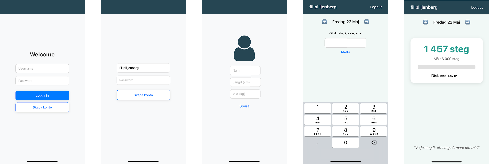

# 👟 Step Tracker

En mobilapp byggd med React Native och Expo som hjälper dig att nå dina dagliga stegmål.

---

## Funktioner

- Skapa ett konto och logga in
- Sätt ditt personliga dagliga stegmål
- Följ din progress i realtid via telefonens stegräknare
- Motiverande citat och visuell progress

---

## Skärmdumpar



-->

---

## Kom igång

### Krav

- [Node.js](https://nodejs.org/) (v18 eller senare)
- [Expo Go](https://expo.dev/client) installerat på din iPhone eller Android
- Ett [MongoDB Atlas](https://www.mongodb.com/atlas)-konto (gratis)

### Installation

**1. Klona projektet**

```bash
git clone https://github.com/ditt-användarnamn/step-tracker.git
cd step-tracker
```

**2. Installera backend**

```bash
cd backend
npm install
```

Skapa en `.env`-fil i `backend`-mappen:

```env
MONGODB_URI=mongodb+srv://<användare>:<lösenord>@cluster.mongodb.net/step-tracker
PORT=5000
```

Starta backend:

```bash
npm run dev
```

**3. Installera frontend**

```bash
cd ../frontend
npm install --legacy-peer-deps
```

Starta frontend:

```bash
npx expo start --clear
```

**4. Öppna appen**

Scanna QR-koden med Expo Go på din telefon.

---

## Teknikstack

Frontend | React Native, Expo, Expo Router |
Backend | Node.js, Express |
Databas | MongoDB Atlas, Mongoose |
